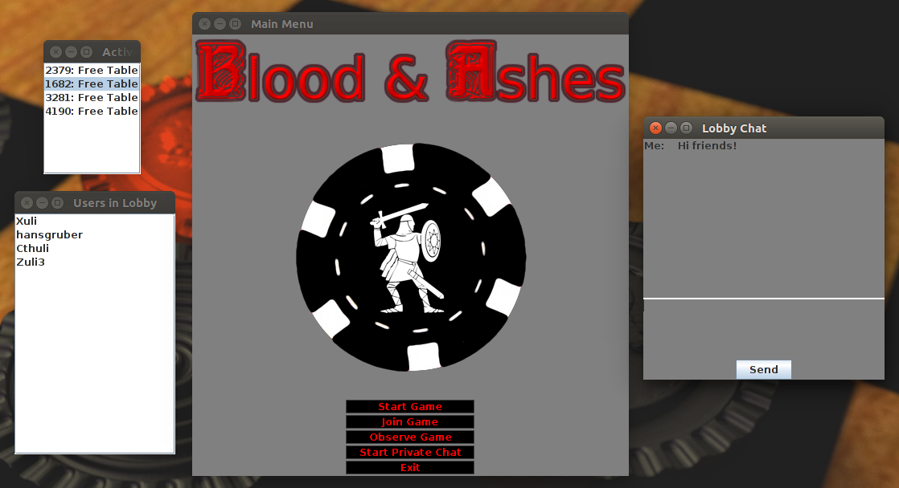

# The BAAC Lobby
Once you've successfully connected to the server and logged in, you will see the BAAC lobby.  

The lobby includes several windows, such as:
* Main menu
* Lobby chat
* Lobby users list
* Active tables list  

Each of these windows is described in detail below

### Main Menu
The main menu is your primary means of navigating through the client.  Your options are listed below:
* **Start Game**: Create a new checkers table to play a game.  The lobby windows will close, and you will be taken to the in-game view while you wait for an opponent.  See the [Playing a Game](play.md) page for more info
* **Join Game**: Join a table that already exists.  You can join any table that has one or more empty seats.  You will be prompted with a list of joinable tables. See the [Playing a Game](play.md) page for more info
* **Observe Game**: Watch a game being played by other users.  You will be prompted with a list of games that you can observe.  See the [Observing a Game](observe.md) page for more info
* **Start Private Chat**: Start a new private chat.  You will be prompted with a list of users available for chatting.  Private chat messages are only visible to you and your chat partner. See the [Chatting](chat.md) page for more info
* **Exit**: Disconnects and closes BAAC

### Lobby Chat
All users in the lobby are able to participate in a global lobby chat.  Any messages you send in this window are visible to all users in the lobby.  See the [Chatting](chat.md) page for more info

### Lobby Users List
The lobby users list window maintains a list of all users currently in the lobby, i.e. all users who will receive lobby chat messages.  You are not able to interact with this list, it is just an informative window.

### Active Tables List
The active tables list window maintains a list of all tables that are currently active.  This includes empty tables, tables where there is one contender, and tables where two players are playing.
