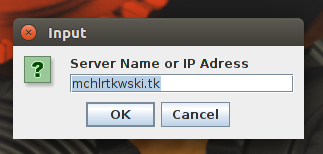
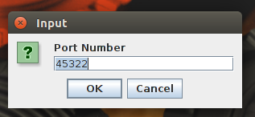

# Getting Started with BAAC
Getting started with BAAC is as easy as point and click!  Once you've installed BAAC, follow these instruction to get up and running!

### Initial Startup
1. Locate ```BabyGotBAAC.jar``` on your computer
2. Double-click the icon to launch BAAC
3. You will be prompted for a server address.  If you know of a specific server you would like to connect to, insert it in the dialog window.  If not, just press 'OK' to accept the default server

4. Once you've selected a server, you will be prompted for a port number.  As with the server selection, if you know the port you'd like to connect to, insert it in the dialog window.  If not, press 'OK' to accept the default port

5. BAAC will now attempt to connect to the server.  This may take a moment, so please be patient
6. Once a connection has been established, you will be prompted for a username.  Choose something fun and unique, then press OK
7. If your username is accepted, the BAAC lobby will load.  Check the [next chapter](lobby.md) to see where to go from here!

#### Potential Problems
* If you do not specify a valid server and port combination, BAAC will exit automatically and you will need to restart it
* If your username is not accepted (there can't be anyone else playing with that username), you will be prompted to enter a new one
